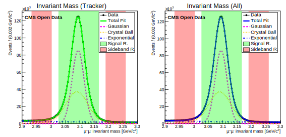
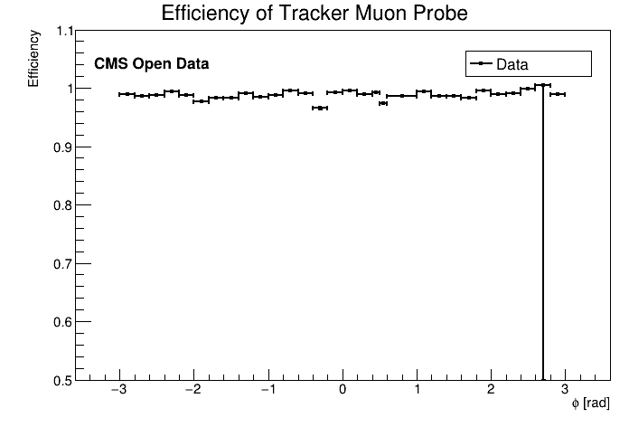

# Sideband

## Signal extraction: sideband subtraction method

The reconstruction efficiency is calculated using **only signal muons**. In order to measure the efficiency, we need a way to extract signal from the dataset. You've used the fitting method and now you'll meet the sideband subtraction method.

This method consists in choosing sideband and signal regions in invariant mass distribution. The sideband regions (shaded in red in the figure) have background particles and the signal region (shared in green in the figure) has background and signal particles.



!!! Note
    The background corresponds to candidates that do not correspond to the decay of a genuine resonance; for example, the pair is formed by the tag muon associated to an uncorrelated track produced elsewhere in the collision; the corresponding invariant mass has thus a smooth continuous shape, that is extrapolated from the signal regions into the sideband region.

For each event category (i.e. Pass and All), and for a given variable of interest (e.g., the probe pT), two distributions are obtained, one for each region (Signal and Sideband). In order to obtain the variable distribution for the signal only, we proceed by subtracting the Background distribution (Sideband region) from the Signal+Background one (Signal region):


Where the normalization α factor quantifies the quantity of background present in the signal region:


And for the uncertainty:


Applying those equations we get histograms like this:


* Solid blue line (Total) = particles in signal region;
* Dashed blue line (Background) = particles in sideband regions;
* Solid magenta line (signal) = signal histogram (background subtracted).

You will see this histogram on this exercise.

!!! Note "About this code"
    More info about this code can be found in the [reference guide](../../sidebandreferenceguide/macro/).

## Preparing files

First, from the root folder of our downloaded repository, we need to go sideband subtraction method tutorial:

```sh
cd efficiency_tools/sideband_subtraction
```

To copy the J/&psi; dataset of real data file to your machine (requires 3,3 GB), type:

```sh
wget -O Run2011AMuOnia_mergeNtuple.root "https://cernbox.cern.ch/index.php/s/lqHEasYWJpOZsfq/download?files=Run2011AMuOnia_mergeNtuple.root"
```

Run this code to download the simulation dataset for J/&psi; (requires 492 MB):

```sh
wget -O JPsiToMuMu_mergeMCNtuple.root "https://cernbox.cern.ch/index.php/s/lqHEasYWJpOZsfq/download?files=JPsiToMuMu_mergeMCNtuple.root"
```

Now, check if everything is ok:

```sh
ls
```

```plaintext
JPsiToMuMu_mergeMCNtuple.root  main  README.md  Run2011AMuOnia_mergeNtuple.root
```

Your `sideband_subtraction` folder should have these files:


## Preparing code for Data

!!! Note
    This tutorial will teach you to manage the files on the terminal, but you can use a graphical file explorer or any other way you are used to.

We need to edit some settings. Open **settings.cpp**:

```sh
cd main/config
ls
```

```plaintext
createHistogram.h  cuts.h  settings.cpp
```

There are different ways to open this file. You can try to run:

```sh
gedit settings.cpp
```

Or, if you can not use gedit, try nano:

```sh
nano settings.cpp
```

!!! Note "I do not have nano!"
    You can try to use **any text editor**, but here is some commands you cant try to use to install it:

    * Ubuntu/Debian: `sudo apt-get -y install nano`.
    * RedHat/CentOS/Fedora: `sudo yum install nano`.
    * Mac OS X: `nano is installed by default`.

We want to calculate **efficiencies of tracker muons**. With the **settings.cpp** file opened, make sure to let the variables like this:

```cpp
//Canvas drawing
bool shouldDrawInvariantMassCanvas       = true;
bool shouldDrawInvariantMassCanvasRegion = true;
bool shouldDrawQuantitiesCanvas          = true;
bool shouldDrawEfficiencyCanvas          = true;

//Muon id analyse   
bool doTracker    = true;
bool doStandalone = false;
bool doGlobal     = false;

//quantity analyse
bool doPt  = true;
bool doEta = true;
bool doPhi = true;
```

We want to calculate the efficiency using specific files that we downloaded. They name are `Run2011AMuOnia_mergeNtuple.root` and `JPsiToMuMu_mergeMCNtuple.root` and are listed in `const char *files[]`. While **settings.cpp** is open, try to use the variable `int useFile` to run `Run2011AMuOnia_mergeNtuple.root`.

??? Example "How to do this"
    Make sure `useFile` is correct:

    ```cpp
    //List of files
    const char *files[] = {"../data_histoall.root",
                           "../Run2011AMuOnia_mergeNtuple.root",""
                           "../JPsiToMuMu_mergeMCNtuple.root",
                           "../Run2011A_MuOnia_Upsilon.root",
                           "../Upsilon1SToMuMu_MC_full.root"};

    const char* directoriesToSave[] = {"../results/result/",
                                       "../results/Jpsi Run 2011/",
                                       "../results/Jpsi MC 2020/",
                                       "../results/Upsilon Run 2011/",
                                       "../results/Upsilon MC 2020/"};


    //MAIN OPTIONS

    //Which file of files (variable above) should use
    int useFile = 1;
    ```

    It will tell which configuration the program will use. So, the macro will run with the ntuple in `files[useFile]` and the results will be stored in `directoriesToSave[useFile]`.

    the first three files won't be used in this exercise.

!!! Note "About code"
    Normally we need to set the variable `const char* resonance`, but at this time it is already done and set automatically for these ntuples' names.

## Editting bins

The code allows to define the binning of the kinematic variable, to ensure each bin is sufficiently populated, for increased robustness. To change the binning, open **createHistogram.h** that is on same folder that **settings.cpp**:

```sh
gedit createHistogram.h
```

Search for the `createEfficiencyPlot(...)` function. You'll find something like this:

```cpp
void createHistogram(TH1D* &histo, const char* histoName)
{...}
```

For each quantity (pT, eta, phi) we used different bins. To change the bins, look inside the `createEfficiencyPlot(...)` function. In a simpler version, you'll see a structure like this:

```cpp
//Variable bin for pT
if (strcmp(quantityName, "Pt") == 0)
{
    //Here creates histogram for pT
}

//Variable bin for eta
else if (strcmp(quantityName, "Eta") == 0)
{
    //Here creates histogram for eta
}

//Bins for phi
else
{
    //Here creates histogram for phi
}
```

??? Example "See the whole scructure"
    Don't be scared! Code does'nt bite.

    ```cpp
    //Variable bin for pT
    if (strcmp(quantityName, "Pt") == 0)
    {
        double xbins[] = {0., 2.0, 3.4, 4.0, 4.4, 4.7, 5.0, 5.6, 5.8, 6.0, 6.2, 6.4, 6.6, 6.8, 7.3, 9.5, 13.0, 17.0, 40.};

        int nbins = sizeof(xbins)/sizeof(*xbins) - 1;
        histo = new TH1D(hName.data(), hTitle.data(), nbins, xbins);
    }

    //Variable bin for eta
    else if (strcmp(quantityName, "Eta") == 0)
    {
        double xbins[] = {-2.4, -1.8, -1.4, -1.2, -1.0, -0.8, -0.5, -0.2, 0, 0.2, 0.5, 0.8, 1.0, 1.2, 1.4, 1.8, 2.4};

        int nbins = sizeof(xbins)/sizeof(*xbins) - 1;
        histo = new TH1D(hName.data(), hTitle.data(), nbins, xbins);
    }

    //Bins for phi
    else
    {
        double xbins[] = {-3.0, -1.8, -1.6, -1.2, -1.0, -0.7, -0.4, -0.2, 0, 0.2, 0.4, 0.7, 1.0, 1.2, 1.6, 1.8, 3.0};

        int nbins = sizeof(xbins)/sizeof(*xbins) - 1;
        histo = new TH1D(hName.data(), hTitle.data(), nbins, xbins);
    }

    //Edit histogram axis
    histo->GetYaxis()->SetTitle(Form(yAxisTitleForm.data(), histo->GetBinWidth(0)));
    histo->GetXaxis()->SetTitle(xAxisTitle.data());
    ```

The code that creates the histogram bins is located inside the conditionals and is commented. You can edit this code and uncomment to create histogram bins however you want. Instead of using a function to generate the bins, we can also define them manually.

As we intend to compare the results between data and simulation, but also between the sideband and fitting methods. You are advised to employ the same bin choice. Garantee your the code uses same bin as the previous here:

```cpp
    //Variable bin for pT
    if (strcmp(quantityName, "Pt") == 0)
    {
        double xbins[] = {0., 2.0, 3.4, 4.0, 4.4, 4.7, 5.0, 5.6, 5.8, 6.0, 6.2, 6.4, 6.6, 6.8, 7.3, 9.5, 13.0, 17.0, 40.};

        int nbins = sizeof(xbins)/sizeof(*xbins) - 1;
        histo = new TH1D(hName.data(), hTitle.data(), nbins, xbins);
    }

    //Variable bin for eta
    else if (strcmp(quantityName, "Eta") == 0)
    {
        double xbins[] = {-2.4, -1.8, -1.4, -1.2, -1.0, -0.8, -0.5, -0.2, 0, 0.2, 0.5, 0.8, 1.0, 1.2, 1.4, 1.8, 2.4};

        int nbins = sizeof(xbins)/sizeof(*xbins) - 1;
        histo = new TH1D(hName.data(), hTitle.data(), nbins, xbins);
    }

    //Bins for phi
    else
    {
        double xbins[] = {-3.0, -1.8, -1.6, -1.2, -1.0, -0.7, -0.4, -0.2, 0, 0.2, 0.4, 0.7, 1.0, 1.2, 1.6, 1.8, 3.0};

        int nbins = sizeof(xbins)/sizeof(*xbins) - 1;
        histo = new TH1D(hName.data(), hTitle.data(), nbins, xbins);
    }
```

## Running the code

After setting the configurations, it's time to run the code. Go back to the **main** directory and make sure `macro.cpp` is there.

```sh
cd ..
ls
```

```plaintext
classes  compare_efficiency.cpp  config  macro.cpp
```

Run the macro.cpp:

```sh
root -l -b -q macro.cpp
```

```plaintext
"../results/Jpsi_Run_2011/" directory created OK
Using "../Run2011AMuOnia_mergeNtuple.root" ntupple
resonance: Jpsi
Using subtraction factor as integral of background fit
Data analysed = 5950253 of 5950253
```

!!! Note
    As this dataset is larger, the code will run slowly. It can take several minutes to be completed depending where the code is been running.

In this process, more informations will be printed in terminal while plots will be created on a specified folder. The message below tells you that code has finished running:

```plaintext
Done. All result files can be found at "../results/Jpsi_Run_2011/"

```

!!! Note "Common errors"
    If you run the code and your terminal printed some erros like:

    ```plaintext
    Error in <ROOT::Math::Cephes::incbi   : Wrong domain for parameter b (must be     0)
    ```

    This occurs when the contents of a bin of the pass histogram is greater than the corresponding bin in the total histogram. With sideband subtraction, depending on bins you choose, this can happen and will result in enormous error bars.

    This issue may be avoided by fine-tuning the binning choice. For now, these messages may be ignored.

## Probe Efficiency results for Data

If all went well, your results are going to be like these:




## Preparing and running the code for simulation

!!! Tip "Challenge"
    Try to run the same code on the `JPsiToMuMu_mergeMCNtuple.root` file we downloaded.

    ??? Example "Tip"

        You will need the redo the steps above, but setting:

        ```cpp
        int useFile = 2;
        ```

        in `main/config/settings.cpp` file.

!!! Note "Comparison between real data and simulation"
    We'll do this in the last section of this exercise. So the challenge above is mandatory.

---

!!! Tip "Extra challenge"
    If you are looking for an extra exercise, you can try to apply the same logic, changing some variables you saw, in order to get results for the &Upsilon; nutpple.

    To download the &Upsilon; real data ntupple (requires 442 MB):

    ```sh
    wget -O Run2011A_MuOnia_Upsilon.root "https://cernbox.cern.ch/index.php/s/lqHEasYWJpOZsfq/download?files=Run2011A_MuOnia_Upsilon.root"
    ```

    Run this code to download the simulation dataset for &Upsilon; (requires 67 MB):

    ```sh
    wget -O Upsilon1SToMuMu_MC_full.root "https://cernbox.cern.ch/index.php/s/lqHEasYWJpOZsfq/download?files=Upsilon1SToMuMu_MC_full.root"
    ```
