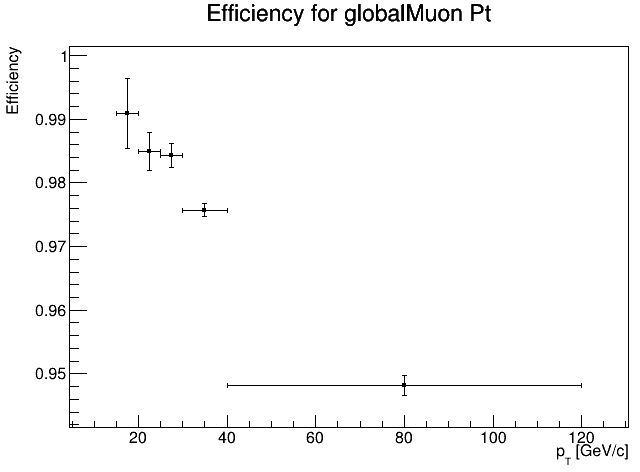

# Fitting method

## Signal extraction: Fitting method

In this method, the signal is extracted not by histogram manipulation but by likelihood fitting. The procedure is applied after splitting the data in sub-samples, corresponding to bins of the kinematic variable of interest of the probe objects. As such, the efficiency will be measured as a function of that variable. Each sub-sample contains signal and background events; the signal is accessed by fitting the invariant mass spectra

The fit for each bin allows to statistically discriminate between signal and background. In particular, the fit yields the number of signal events. The efficiency is finally obtained by simply forming the ratio of the signal yield from the fit to the passing category by the signal yield from the fit of the inclusive all category. This approach is illustrated below.


## Setting it up

First, clone this repository.

```sh
git clone --branch systematic https://github.com/RodrigoCampelloS/TagAndProbe.git
cd TagAndProbe/efficiency_tools/fitting
```

You will also need to download the TagAndProbe_Z_Run2012.root file using this link.

```sh
https://cernbox.cern.ch/files/link/public/lqHEasYWJpOZsfq/simplified_datasets_for_fitting_method?items-per-page=100&view-mode=resource-table&tiles-size=1
```

For MC data you need to download the TagAndProbe_Z_MC.root using the same link. You can also download the TagAndProbe_Jpsi_Run2011.root and TagAndProbe_Jpsi_MC.root files if you wish to use the Jpsi particle instead.

## Editing the Fit

You will have 3 options to edit in order to better fit your needs.

1- Which type of data do you want to use?

```cpp
//uncomment the fit you want to do 
#include "src/dofits/DoFit_Z.h"
//#include "src/dofits/DoFit_Z_MC.h"

```

2- Which Muon Id you want to use?

```cpp
//Which Muon Id do you want to study?
//string MuonId   = "trackerMuon";
//string MuonId   = "standaloneMuon";
string MuonId   = "globalMuon";
```

3- Which quantity you want to use?

```cpp
//Which Quantity?
string quantity = "Pt";     double bins[] = {15.0,20.0,25.0,30.0,40.0,120.0};
//string quantity = "Eta";    double bins[] = {-2.4, -1.8, -1.4, -1.2, -1.0, -0.8, -0.5, -0.2, 0, 0.2, 0.5, 0.8, 1.0, 1.2, 1.4, 1.8, 2.4};
//string quantity = "Phi";    double bins[] = {-3.0, -1.8, -1.6, -1.2, -1.0, -0.7, -0.4, -0.2, 0, 0.2, 0.4, 0.7, 1.0, 1.2, 1.6, 1.8, 3.0};
```

## Running the Code

In order to do the fit you will have to run this code:

```cpp
root efficiency_Z.cpp 
```

You should get something like this:



!!! Note
    for the Jpsi particle use efficiency_Jpsi.cpp

You can always further check the result using the TBrowser

```cpp
root
new TBrowser
```

Go to results>efficiencies>efficiency>Z_Run>Pt_GlobalMuon.root>globalMuon_Pt_Efficiency and you should get something like this:


