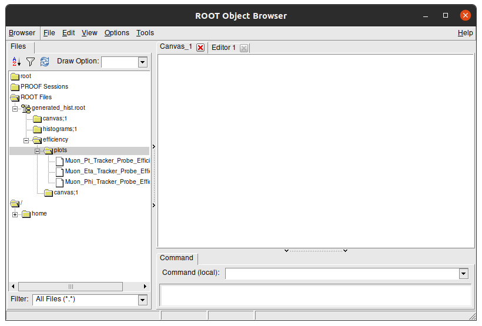
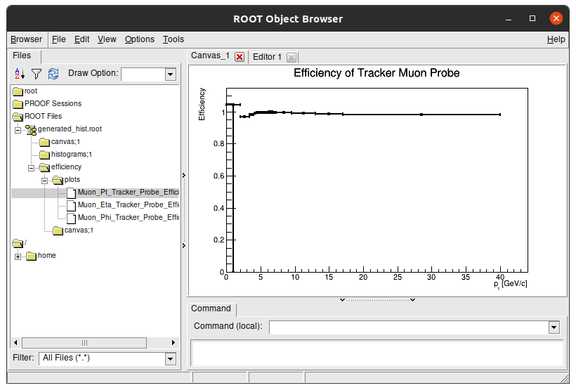
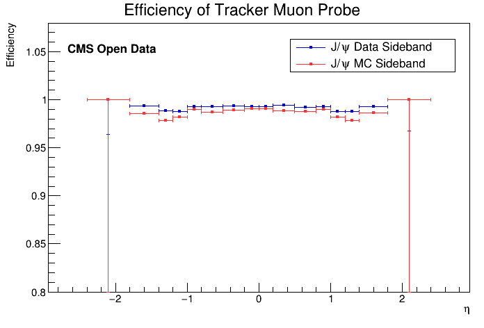
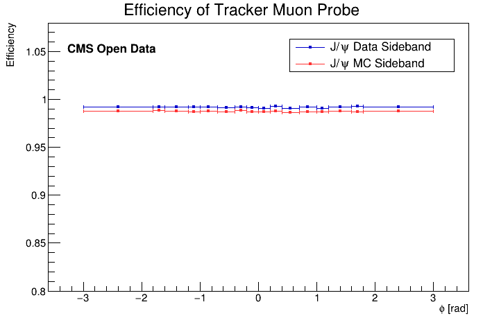

# How to make a comparison between two previous methods of signal extraction

## How sideband subtraction method code stores its files

the Sideband subtraction code saves every efficiency plot in `efficiency/plots/` folder inside a single `generated_hist.root` file. Lets check it!

You're probably on the `main` directory. Lets go back one directory.

```sh
cd ..
ls
```

```plaintext
JPsiToMuMu_mergeMCNtuple.root  README.md  Run2011AMuOnia_mergeNtuple.root
main                           results
```

A folder named `results` showed up on this folder. Lets go check its content.

```sh
cd results
ls
```

```plaintext
Jpsi_MC_2020  Jpsi_Run_2011
```

If you did every step of the sideband subtraction on this page lesson, these results should match with the results on your pc. Access one of those folders (except comparison).

```sh
cd Jpsi_Run_2011
ls
```

```plaintext
Efficiency_Tracker_Probe_Eta.png  Tracker_Probe_Eta_All.png
Efficiency_Tracker_Probe_Phi.png  Tracker_Probe_Eta_Passing.png
Efficiency_Tracker_Probe_Pt.png   Tracker_Probe_Phi_All.png
generated_hist.root               Tracker_Probe_Phi_Passing.png
InvariantMass_Tracker.png         Tracker_Probe_Pt_All.png
InvariantMass_Tracker_region.png  Tracker_Probe_Pt_Passing.png
```

Here, all the output plots you saw when running the sideband subtraction method are stored as a `.png`. Aside from them, there's a `generated_hist.root` that stores the efficiency in a way that we can manipulate it after. This file is needed to run the comparison between efficiencies for the sideband subtraction method. Lets look inside of this file.

Run this command to open `generated_hist.root` with ROOT:

```sh
root -l generated_hist.root
```

```plaintext
root [0] 
Attaching file generated_hist.root as _file0...
(TFile *) 0x55dca0f04c50
root [1]
```

Lets check its content. Type on terminal:

```sh
new TBrowser
```

You should see something like this:


This is a visual navigator of a `.root` file. Here you can see the struture of `generated_hist.root`. Double click the folders to open them and see their content. The Efficiency plots we see are stored in `efficiency/plots/` folder:



You can double click each plot to see its content:



!!! Tip
    To close this window, click on terminal and press `Ctrl` + `C`. This command stops any processes happening in the terminal.

!!! Info "Key Point"
    * As you see, the `.root` file has paths inside of it and the efficiencies plots have a self path inside them as well!

## Comparison results between real data and simulations for sideband method

After runinng the sideband subtraction code, we get a `.root` with all the efficiencies plots inside it in two different folders:

* `../results/Jpsi_Run_2011/generated_hist.root`
* `../results/Jpsi_MC_2020/generated_hist.root`

We'll get back to this on the discussion below.

Head back to the `main` folder. Inside of it there is a code for the efficiency plot comparison. Lets check it out. From the `sideband_subtraction` folder, type:

```sh
cd main
ls
```

```plaintext
classes  compare_efficiency.cpp  config  macro.cpp
```

There is it. Now lets open it.

```sh
gedit compare_efficiency.cpp
```

Its easy to prepare it for the sideband subtraction comparison. Our main editing point can be found in this part:

```cpp
//CONFIGS

int useScheme = 0;
//Jpsi    Sideband Run vs Jpsi    Sideband MC
//Jpsi    Fitting  Run vs Jpsi    Fitting  MC
//Jpsi    Sideband Run vs Jpsi    Fitting  Run
//Upsilon Sideband Run vs Upsilon Sideband MC
//Upsilon Fitting  Run vs Upsilon Fitting  MC
//Upsilon Sideband Run vs Upsilon Fitting  Run

//Muon id analyse
bool doTracker    = true;
bool doStandalone = true;
bool doGlobal     = true;

//quantity analyse
bool doPt  = true;
bool doEta = true;
bool doPhi = true;
```

!!! Note
    In the scope above we see:

    * `int useScheme` represents which comparison you are doing.
    * `bool doTracker` is a variable that allow plots for tracker muons.
    * `bool doStandalone` is a variable that allow plots for standalone muons.
    * `bool doGlobal` is a variable that allow plots for global muons.
    * `bool doPt` is a variable that allow plots for muon pT.
    * `bool doEta` is a variable that allow plots for muon &eta;.
    * `bool doPhi` is a variable that allow plots for muon &phi;.

Everything is up to date to compare sideband subtraction's results between real data and simulations, except it is comparing standalone and global muons. As we are  looking for tracker muons efficiencies only, you should **switch to false variables for Standalone and Global**.

Also, you will need to change the `useScheme` variable to plot what you want to plot. As we want to plot **efficiency of real data and simulated data**, the value has to be 0.

??? Example "See result scructure"
    If you deleted the right lines, your code now should be like this:

    ```cpp
    //CONFIGS

    int useScheme = 0;
    //Jpsi    Sideband Run vs Jpsi    Sideband MC
    //Jpsi    Fitting  Run vs Jpsi    Fitting  MC
    //Jpsi    Sideband Run vs Jpsi    Fitting  Run
    //Upsilon Sideband Run vs Upsilon Sideband MC
    //Upsilon Fitting  Run vs Upsilon Fitting  MC
    //Upsilon Sideband Run vs Upsilon Fitting  Run

    //Muon id analyse
    bool doTracker    = true;
    bool doStandalone = false;
    bool doGlobal     = false;

    //quantity analyse
    bool doPt  = true;
    bool doEta = true;
    bool doPhi = true;
    ```

    Let your variables like this.

Now you need to run the code. To do this, save the file and type on your terminal:

```sh
root -l compare_efficiency.cpp
```

If everything went well, the message you'll see in terminal at end of the process is:

```plaintext
Use Scheme: 0
Done. All result files can be found at "../results/Comparison_Upsilon_Sideband_Run_vs_MC/"
```

!!! Note
    The command above to run the code will display three new windows on your screen with comparison plots. You can avoid them by running straight the **command below**.

    ```cpp
    root -l -b -q compare_efficiency.cpp
    ```
   
    In this case, to check it results you are going to need go for result folder (printed on code run) and check images there by yourself.
    You can try to run `new TBrowser` again:
   
    ```cpp
    cd [FOLDER_PATH]
    root -l
    new TBrowser
    ```

And as output plots comparsion, you get:





Now you can type the command below to **quit root** and close all created windows:

```sh
.q
```

## How fitting method code stores its files

To do the next part, first you need to understand how the fitting method code saves. It is not so different than sideband subtraction method. Lets look at how they are saved.

If you look inside `fitting\results'` folder, where is stored fitting method results, you will see another folder named `efficiencies`. lets go there by terminal from `fitting` folder:

```sh
cd results/efficiencies
ls
```

```plaintext
efficiency
```

Inside of it there is a unique folder named efficiency. It is necessary because later on, we will work in efficiencies in 2 dimentions. The efficiency folder means it is one-dimensional, which we worked here so on.

```sh
cd efficiency
ls
```

```plaintext
Comparison_Run2011_vs_MC  Jpsi_MC_2020  Jpsi_Run_2011
```

Let's go inside one of them:

```sh
cd Jpsi_Run_2011
ls
```

```plaintext
Pt_trackerMuon.root
```

For every configuration for a specific dataset, they will create `.root` files inside its respectively folder. For example, this one folder that we choose will have all calculations for the J/&psi; real data dataset.

If you go with your terminal to this folder and run this command, you'll see that the result files only have one plot on main folder.

```sh
root -l Pt_trackerMuon.root 
```

```plaintext
root [0] 
Attaching file Pt_trackerMuon.root as _file0...
(TFile *) 0x55efb5f44930
root [1]
```

Now lets look at its content. Type on terminal:

```cpp
new TBrowser
```

It has only one plot, because the others are in different files. Inside the folder `histograms`, you can find the histograms that created this efficiency result.


!!! Info "Key Point"
    * There is a `.root` file for each efficiency plot created with the fitting method.

## Comparison results between real data and simulations for fitting method

Go back to the `main` folder on `sideband_subtraction` folder.

```cpp
cd main
ls
```

```plaintext
classes  compare_efficiency.cpp  config  macro.cpp
```

Open **compare_efficiency.cpp** again

```sh
gedit compare_efficiency.cpp
```

This is how your code should look like now:

```cpp
//CONFIGS

int useScheme = 0;
//Jpsi    Sideband Run vs Jpsi    Sideband MC
//Jpsi    Fitting  Run vs Jpsi    Fitting  MC
//Jpsi    Sideband Run vs Jpsi    Fitting  Run
//Upsilon Sideband Run vs Upsilon Sideband MC
//Upsilon Fitting  Run vs Upsilon Fitting  MC
//Upsilon Sideband Run vs Upsilon Fitting  Run

//Muon id analyse
bool doTracker    = true;
bool doStandalone = false;
bool doGlobal     = false;

//quantity analyse
bool doPt  = true;
bool doEta = true;
bool doPhi = true;
```

You have to do just two things:

1. edit `int useScheme` value to current analysis.

2. Put others quantities expect `pT` to false, we did not obtained &eta; nor &phi; results on previous page.

??? Example "After making those edits"
    Your code should look like this:

    ```cpp
    //CONFIGS

    int useScheme = 1;
    //Jpsi    Sideband Run vs Jpsi    Sideband MC
    //Jpsi    Fitting  Run vs Jpsi    Fitting  MC
    //Jpsi    Sideband Run vs Jpsi    Fitting  Run
    //Upsilon Sideband Run vs Upsilon Sideband MC
    //Upsilon Fitting  Run vs Upsilon Fitting  MC
    //Upsilon Sideband Run vs Upsilon Fitting  Run

    //Muon id analyse
    bool doTracker    = true;
    bool doStandalone = false;
    bool doGlobal     = false;

    //quantity analyse
    bool doPt  = true;
    bool doEta = false;
    bool doPhi = false;
    ```

Doing this and running the program with:

```sh
root -l compare_efficiency.cpp
```

Should get you these results:


!!! Tip "Challenge"
    As you notice here we presented comparison for &eta; and &phi;. Try to go back to fitting method tutorial and redo commands to get efficiencies for these quantities in order to compare with sideband subctraction method. Do not forget to turn `bool doEta` and `bool doPhi` true.

Now you can type the command below to **quit root** and close all created windows:

```sh
.q
```

## Comparison results between data from the sideband and data from the fitting method

!!! Tip "Challenge"
    Using what you did before, try to mix them and plot a comparison **between real data for sideband method and real data for sthe fitting method** and get an analysis.
    Notice that:

    * Real data = Run 2011
    * Simulations = Monte Carlo = MC
   
    Tip: you just need to change what you saw in this page to do this comparison.

---

!!! Tip "Extra challenge"
    As you did with the last 2 extras challenges, try to redo this exercise comparing results between &Upsilon; datas.
