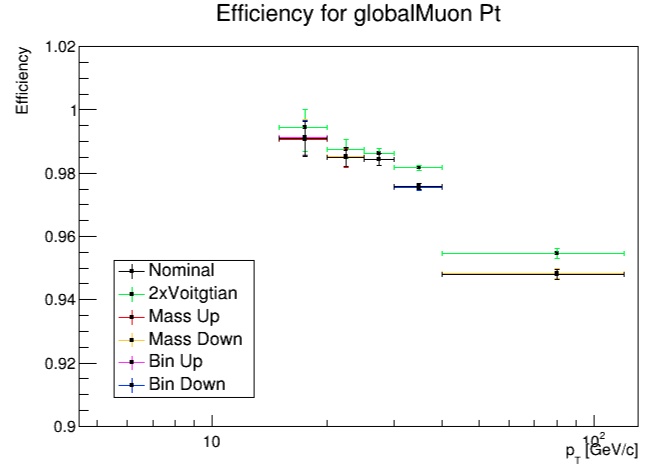
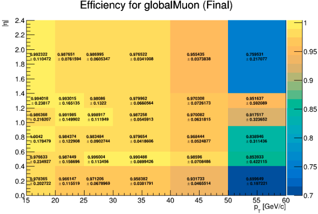
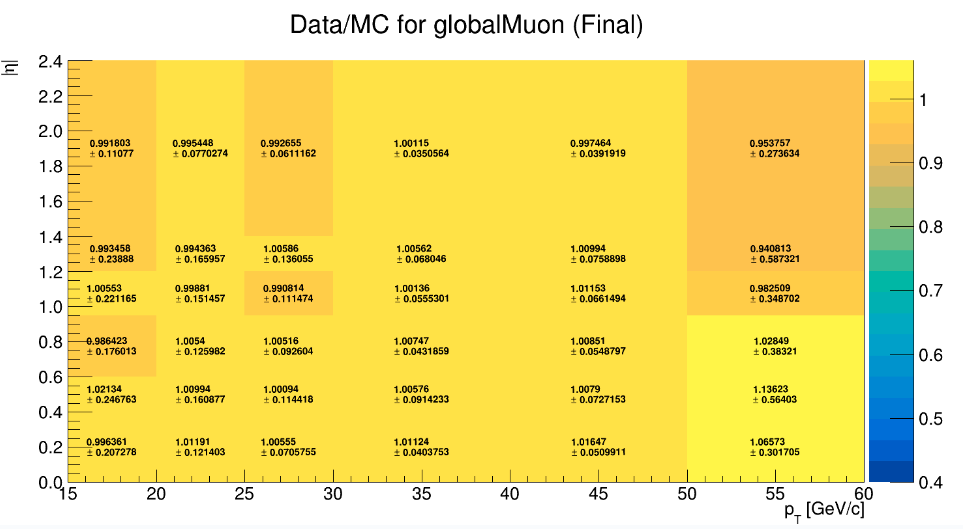

# Procedures and strategy for estimating the systematics uncertainties

## Setting it up

First, clone this repository.

```sh
git clone --branch systematic https://github.com/RodrigoCampelloS/TagAndProbe.git
cd TagAndProbe/efficiency_tools/fitting
```
You will also need to download the TagAndProbe_Z_Run2012.root file using this link.

```sh
https://cernbox.cern.ch/files/link/public/lqHEasYWJpOZsfq/simplified_datasets_for_fitting_method?items-per-page=100&view-mode=resource-table&tiles-size=1
```

For MC data you need to download the TagAndProbe_Z_MC.root using the same link. You can also download the TagAndProbe_Jpsi_Run2011.root and TagAndProbe_Jpsi_MC.root files if you wish to use the Jpsi particle instead.

## Estimations of systematics uncertainty sources

To estimate the systematic error we will need first to get some uncertainties from the DATA. So, to do that, run the following code.

```sh
root -l -b -q plot_sys_efficiency_Z.cpp
```
By default, this code will estimate the Muon ID efficiency for the Global Muon ID for |η| distribution, this can be changed by opening the "plot_sys_efficiency_Z.cpp" and commenting and uncommenting the Muon ID and quantity of your desire. This process may take several minutes to complete.

The systematics uncertainties will be evaluated by making small changes in the fit on the invariant mass distribution of the resonance. For example, the Z decaying in dimuons, in this case, the changes were: 2xVoigtian ("2x Voigtian" as in the code) which means fitting with two voigtians. The other sources are the upper and under limits of invariant mass distribution and so "Mass Up" means making the mass window bigger, and "Mass Down" means making the mass window smaller. Last source you can modify the bin size of the same distribution. "Bin up" means making the fit with more bins and "Bin down" means making the fit with fewer bins.

In order to do the next step you will have to run the "plot_sys_efficiency_Z.cpp" for the Pt of both global and tracker Muon. To get the Pt for the tracker Muons the code should look like this.

```cpp
//Which Muon Id do you want to study?
string MuonId   = "trackerMuon";
//string MuonId   = "standaloneMuon";
//string MuonId   = "globalMuon";

//Which quantity do you want to use?

//for Z
string quantity = "Pt";     double bins[] = {15.0,20.0,25.0,30.0,40.0,120.0};
//string quantity = "Eta";    double bins[] = {-2.4, -1.8, -1.4, -1.2, -1.0, -0.8, -0.5, -0.2, 0, 0.2, 0.5, 0.8, 1.0, 1.2, 1.4, 1.8, 2.4};
//string quantity = "Phi";    double bins[] = {-3.0, -1.8, -1.6, -1.2, -1.0, -0.7, -0.4, -0.2, 0, 0.2, 0.4, 0.7, 1.0, 1.2, 1.6, 1.8, 3.0};

```

and like this to the global Muons.

```cpp
//Which Muon Id do you want to study?
//string MuonId   = "trackerMuon";
//string MuonId   = "standaloneMuon";
string MuonId   = "globalMuon";

//Which quantity do you want to use?

//for Z
string quantity = "Pt";     double bins[] = {15.0,20.0,25.0,30.0,40.0,120.0};
//string quantity = "Eta";    double bins[] = {-2.4, -1.8, -1.4, -1.2, -1.0, -0.8, -0.5, -0.2, 0, 0.2, 0.5, 0.8, 1.0, 1.2, 1.4, 1.8, 2.4};
//string quantity = "Phi";    double bins[] = {-3.0, -1.8, -1.6, -1.2, -1.0, -0.7, -0.4, -0.2, 0, 0.2, 0.4, 0.7, 1.0, 1.2, 1.6, 1.8, 3.0};

```
If you want to use the MC data, you need to change which fit you will use at the beginning of the code. If this is the case, your code should look like this

```
//Change if you need

//#include "src/dofits/DoFit_Jpsi_Run.h"
//#include "src/dofits/DoFit_Jpsi_Run_2xGaus.h"

//#include "src/dofits/DoFit_Z_Run_2xVoigtian.h"
//#include "src/dofits/DoFit_Z.h"

#include "src/dofits/DoFit_Z_MC.h"
#include "src/dofits/DoFit_Z_MC_2xVoigtian.h"
```

For Jpsi use
```sh
root -l -b -q plot_sys_efficiency_Jpsi.cpp
```
and make the same adjustments but make sure you are changing the fits you use and the MuonId of the correct function.

## Systematic efficiency overplot

To better understand the results of the last part, this code will put all the different plots created previously in an image.

```cpp
root overplot_efficiencies.cpp
```

You should get a result like this:



If you're using the Jpsi particle you need to uncomment line 4 and comment line 3. If that's the case, your code should look like this.
```
#include "src/create_folder.h"
//choose the particle
//string particle ="Z";
string particle ="Jpsi";
TEfficiency* read_TEfficiency(const char* folder_path, const char* file_name, const char* TEfficiency_path)
```

## 2D Efficiency Map

This code generates a 2D systematic efficiency overplot, it outputs a .root that contains the efficiency histograms that can be visualised by the root TBrowser.

```sh
root -l -b -q plot_sys_efficiency_2d.cpp
```

This is one of the graphs that will be generated.



It is noteworthy that the uncertainties presented above in the 2d map are already the quadrature sum of systematics and statistical uncertainties.

If you're using the Jpsi particle you need to choose which fit function you will use and the particle. Your code should look like this.
```
//Change if you need
#include "src/dofits/DoFit_Jpsi_Run.h"
#include "src/dofits/DoFit_Jpsi_Run_2xGaus.h"
#include "src/dofits/DoFit_Z_Run_2xVoigtian.h"
//#include "src/dofits/DoFit_Z.h"
//#include "src/dofits/DoFit_Z_MC.h"
//#include "src/dofits/DoFit_Z_MC_2xVoigtian.h"
//#include "src/dofits/DoFit_Jpsi_MC.h"
//#include "src/dofits/DoFit_Jpsi_MC_2xGaus.h"
#include "src/create_folder.h"
#include "src/create_TH2D.h"
#include "src/get_efficiency_TH2D.h"
#include "src/get_efficiency_TH2DJpsi.h"
#include "src/yields_n_errs_to_TH2Ds_bin.h"

//particle
//string particle = "Z";
string particle = "Jpsi";
```

## Scale Factor

For this one, you will have to run the same commands as before but with MC (Monte Carlo) data, follow the same steps as before but with the new file as your source. This 2d map consists of dividing the real data efficiency value by the MC efficiency value.

```sh
root -l -b -q scale_factor_Z.cpp
```
This is one of the graphs that will be generated.



If you are using the Jpsi particle use this instead

```sh
root -l -b -q scale_factor_Jpsi.cpp
```
