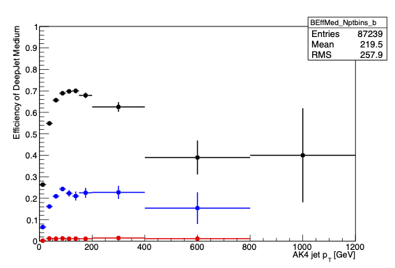
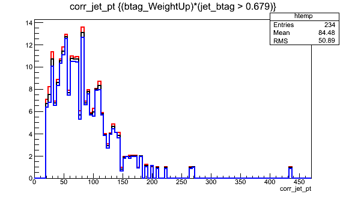

# B Tag Uncertainty

## Scale Factors
In simulation, 
- Efficiency for tagging b quarks as b jets: the number of "real b jets" (jets spatially matched to generator-level b hadrons) tagged as b jets divided by the number of real b jets. 
- Efficiency for mis-tagging c or light quarks as b jets: real c/light jets tagged as b jets divided by real c/light jets. 

These values are typically computed as functions of the momentum or pseudorapidity of the jet. The "real" flavor of the jet is accessed most simply by creating pat::Jet objects instead of reco::Jet objects.

Scale factors to increase or decrease the number of b-tagged jets in simulation can be applied in a number of ways, but typically involve weighting simulation events based on the efficiencies and scale factors relevant to each jet in the event. Scale factors for the CSV algorithm are available for Open Data and involve extracting functions from a comma-separated-values file. The main documentation for b tagging and scale factors can be found [in the b tagging recommendation twiki](https://twiki.cern.ch/twiki/bin/view/CMSPublic/BtagRecommendation2011OpenData).

### Applying Scale Factors

#### Calculating Efficiencies
The [BTagging folder](https://github.com/cms-legacydata-analyses/PhysObjectExtractorTool/tree/master/BTagging) of PhysObjectExtractorTool ([POET](https://github.com/cms-legacydata-analyses/PhysObjectExtractorTool)) is used for calculating the efficiency for tagging each flavor of jet as a b quark, as a function of the jet momentum with the file [WeightAnalyzer.cc](https://github.com/cms-legacydata-analyses/PhysObjectExtractorTool/blob/master/BTagging/src/WeightAnalyzerBEff.cc). The purpose of this file is to set up jet momentum histograms for numerators and denominators of efficiency histograms as defined above. The code loops through the jets, checks their flavor, checks their btagging discriminator to see if it passes tight, medium and or loose cut, and then fills the histograms according to that information. 

```
    double disc = it->bDiscriminator(discriminatorStr);
    int hadronFlavor = it->partonFlavour();
    
    if( abs(hadronFlavor)==5 ){
      BEff_Dptbins_b->Fill(pt,weight);      
      if( disc >= discriminatorValueT) BEffTight_Nptbins_b->Fill(pt,weight);
      if( disc >= discriminatorValueM) BEffMed_Nptbins_b->Fill(pt,weight);
      if( disc >= discriminatorValueL) BEffLoose_Nptbins_b->Fill(pt,weight);
    } else if( abs(hadronFlavor)==4 ){
      ...
```
These historgrams are then stored in an output file.

Input, output, and other parameters can be changed in the [config file](https://github.com/cms-legacydata-analyses/PhysObjectExtractorTool/blob/master/BTagging/python/befficiency_patjets_cfg.py).

After this, you can save, exit, and compile, and then move onto the [config file](https://github.com/cms-legacydata-analyses/PhysObjectExtractorTool/blob/master/BTagging/python/befficiency_patjets_cfg.py). You will put the file(s) which you wish to run efficiencies on here:
```
##### ------- This is a test file
process.source = cms.Source("PoolSource",
        fileNames = cms.untracked.vstring(
        'root://eospublic.cern.ch//eos/opendata/cms/MonteCarlo2012/Summer12_DR53X/TTbar_8TeV-Madspin_aMCatNLO-herwig/AODSIM/PU_S10_START53_V19-v2/00000/04FCA1D5-E74C-E311-92CE-002590A887F0.root'))
```
Once this is complete, you can run the [config file](https://github.com/cms-legacydata-analyses/PhysObjectExtractorTool/blob/master/BTagging/python/befficiency_patjets_cfg.py) for your efficiencies. 

#### Run Complete
Once your run is complete, in the 'BTagging' folder there should be a file called [plotBeff.C](https://github.com/cms-legacydata-analyses/PhysObjectExtractorTool/blob/master/BTagging/plotBeff.C). This file is set up to do the numerator and denomenator divisions (as defined earlier), show you a histogram of your efficiencies from those calculations, and write the same efficiencies that you calculated in a numerical form. To run this code open this file in root like such: 
```
root plotBeff.c
```
The histogram and output should appear through root. An example of what the histogram should look like is this:



###### If Needed: Updating Momentum Bin Code
<sub> In [WeightAnalyzer.cc](https://github.com/cms-legacydata-analyses/PhysObjectExtractorTool/blob/master/BTagging/src/WeightAnalyzerBEff.cc), there is a spot to input custom jet momentum bins that looks like this: </sub>
```
double ptbinsB[10] = {0, 15, 30, 50, 70, 100, 150, 200, 500, 1000};
```
<sub> where a bin's momentums span from 0 to 15, 15 to 30, etc. </sub>

<sub> After your jet momentum bin update, you need to update the actual code that produces the histogram. Continuing this example, there are a total of 9 momentum bins from the numbers given in, ptbinsB. In the histogram producing code, there is a 9 indicating the number of bins: </sub>
```
  BEff_Dptbins_b    = fs->make<TH1D>("BEff_Dptbins_b   ","",9,ptbinsB); BEff_Dptbins_b->Sumw2();
```
<sub> Where the number 9 is now, this number will need to be updated to your number of bins. </sub>	
	
#### Access Efficiencies
Once you have your efficiencies, you can then put them in to the [3 look up functions](https://github.com/cms-legacydata-analyses/PhysObjectExtractorTool/blob/master/PhysObjectExtractor/src/PatJetAnalyzer.cc#L199-L242) that have been implemented in PatJetAnalyzer for storing efficiencies. Here, for example, is the b tag efficiencies function which returns efficiency given a jet momentum:
```
double
PatJetAnalyzer::getBtagEfficiency(double pt){
  if(pt < 25) return 0.263407;
  else if(pt < 50) return 0.548796;
  else if(pt < 75) return 0.656801;
  else if(pt < 100) return 0.689167;
  else if(pt < 125) return 0.697911;
  else if(pt < 150) return 0.700187;
  else if(pt < 200) return 0.679236;
  else if(pt < 400) return 0.625296;
  else return 0.394916;
}
```

#### Access Scale Factors

[The data file](https://twiki.cern.ch/twiki/pub/CMSPublic/BtagRecommendation2011OpenData/CSV.csv) provided by the CMS b tagging group contains the scale factor functions for all types of jets. Some important titles to give more context to are as follows: 
- OperatingPoint - This is the light (0), medium (1), or tight (2) cut of the flavored jet.
- formula - This is the equation for calculating the scale factor, where x is the momentum of the jet.
- jetFlavor - b = 0, c = 1, udsg = 2.

Sorting Columns and creating filters with the .csv file can make accessing and finding sepcific scale factor equations easier. For example, filtering the OperatingPoint column to only show the number 1 will give you only medium cut jet information. Other useful information about the .csv file can be found [here](https://twiki.cern.ch/twiki/bin/view/CMSPublic/BTagCalibration).

The scale factor equations from the folumla column have been implemented in POET! In PatJetAnalyzer there are 2 functions, one for b and c flavored jets and one for light flavored jets, that return the scale factor of the jet depending on the momentum of the jet. Below is the b and c tag function.
```
double
PatJetAnalyzer::getBorCtagSF(double pt, double eta){
  if (pt > 670.) pt = 670;
  if(fabs(eta) > 2.4 or pt<20.) return 1.0;

  return 0.92955*((1.+(0.0589629*pt))/(1.+(0.0568063*pt)));
}
```
Look at this twiki for [additional information about scale factors](https://twiki.cern.ch/twiki/bin/view/CMSPublic/BtagRecommendation2011OpenData#Data_MC_Scale_Factors).

### Calculating Weights
Once these functions are updated to their desired states, weight calculating can happen! The first thing to check for when event weight calculating is this:
`
if (jet_btag.at(value_jet_n) > 0.679)
`. This check is to see whether or not the jet distminator makes the cut we want our jets to make. In this case, we want our jets to make the medium cut (.679). If a jet makes the cut, there are then a couple more checks to be made:
````
  if(abs(hadronFlavour) == 5){
  	eff = getBtagEfficiency(corrpt);
	SF = getBorCtagSF(corrpt, jet_eta.at(value_jet_n));
	SFu = SF + uncertaintyForBTagSF(corrpt, jet_eta.at(value_jet_n));
	SFd = SF - uncertaintyForBTagSF(corrpt, jet_eta.at(value_jet_n));
  } else if(abs(hadronFlavour) == 4){
	eff = getCtagEfficiency(corrpt);
	SF = getBorCtagSF(corrpt, jet_eta.at(value_jet_n));
	SFu = SF + (2 * uncertaintyForBTagSF(corrpt, jet_eta.at(value_jet_n)));
	SFd = SF - (2 * uncertaintyForBTagSF(corrpt, jet_eta.at(value_jet_n)));
  } else {
	eff = getLFtagEfficiency(corrpt);
	SF = getLFtagSF(corrpt, jet_eta.at(value_jet_n));
	SFu = SF + ( uncertaintyForLFTagSF(corrpt, jet_eta.at(value_jet_n)));
	SFd = SF - ( uncertaintyForLFTagSF(corrpt, jet_eta.at(value_jet_n)));
  }
````
This section first finds which flavor of jet it is (b = 5, c = 4, and light = anything else) and then gets the efficiency for the respected jet, as well as calculates its scale factor. It also calculates its up and down quarked scale factors of the jet. Once these checks and calculations are complete, the following calulations can occur:
```
 MC *= eff;
 btagWeight *= SF * eff;
 btagWeightUp *= SFu * eff;
 btagWeightDn *= SFd * eff;
```
These calculations are the probability of a given configuration of jets in MC simulation (`MC`) and data (`btagWeight`, `btagWeightUp`, and `btagWeightDn`).
The same process with a little bit different probability calculating is done if the jet did not meet the desired cut. 

Once these checks have finished for every jet you are looking at, a final calculation for the event weights is done.
```
btagWeight = (btagWeight/MC);
btagWeightUp = (btagWeightUp/MC);
btagWeightDn = (btagWeightDn/MC);
```

NOTE: There are many ways to go about calculating event weights. This [link](https://twiki.cern.ch/twiki/bin/view/CMSPublic/BtagRecommendation2011OpenData#Methods_to_Apply_b_Tagging_Effic) shows a couple of the different ways. In POET, method 1a is the method used.

### Uncertainties
As we just saw in the "Calculating Weights" section above, there are uncertainties that need to be considered. These uncertainties are actually already taken into account in the .csv file. When looking at the scale factor equation, there should be a main equation followed by either an addition or subtraction of a number, which is the uncertainty.
#### Uncertainties for Each Flavor
In POET, there are 2 functions for the uncertainty, one for the b tag uncertainty and one for the light flavor tag uncertainty. The reason that there is not one specifically for c tagged jets is because c tagged jet's uncertainty is two times that of the b tagged jet's uncertainty, so you can simply multiply the b tag uncertainty call by two, as seen here: `SFu = SF + (2 * uncertaintyForBTagSF(corrpt, jet_eta.at(value_jet_n)));`

Here is what the b tag uncertainty function looks like, which returns the uncertainty given a jet momentum:
```
double
PatJetAnalyzer::uncertaintyForBTagSF( double pt, double eta){
  if(fabs(eta) > 2.4 or pt<20.) return 0;
  if(pt < 30) return 0.0466655;
  else if(pt < 40) return 0.0203547;
  else if(pt < 50) return 0.0187707;
  else if(pt < 60) return 0.0250719;
  else if(pt < 70) return 0.023081;
  else if(pt < 80) return 0.0183273;
  else if(pt < 100) return 0.0256502;
  else if(pt < 120) return 0.0189555;
  else if(pt < 160) return 0.0236561;
  else if(pt < 210) return 0.0307624;
  else if(pt < 260) return 0.0387889;
  else if(pt < 320) return 0.0443912;
  else if(pt < 400) return 0.0693573;
  else if(pt < 500) return 0.0650147;
  else return 0.066886;
}
```
#### Storing Final Weights
Also from the "Calculating Weights" section, there are 3 final variables that are used to store the final event weights that were calculated: 
`btagWeight `, `btagWeightUp` , and `btagWeightDn`. When the file has completed running, you can run root with your output file and look up these 3 names to access the data calculated from your run. Here is an example of these variables accessed in root (Normal - Black, Up - Red, Down - Blue): 




!!! Warning
    This page is under construction
